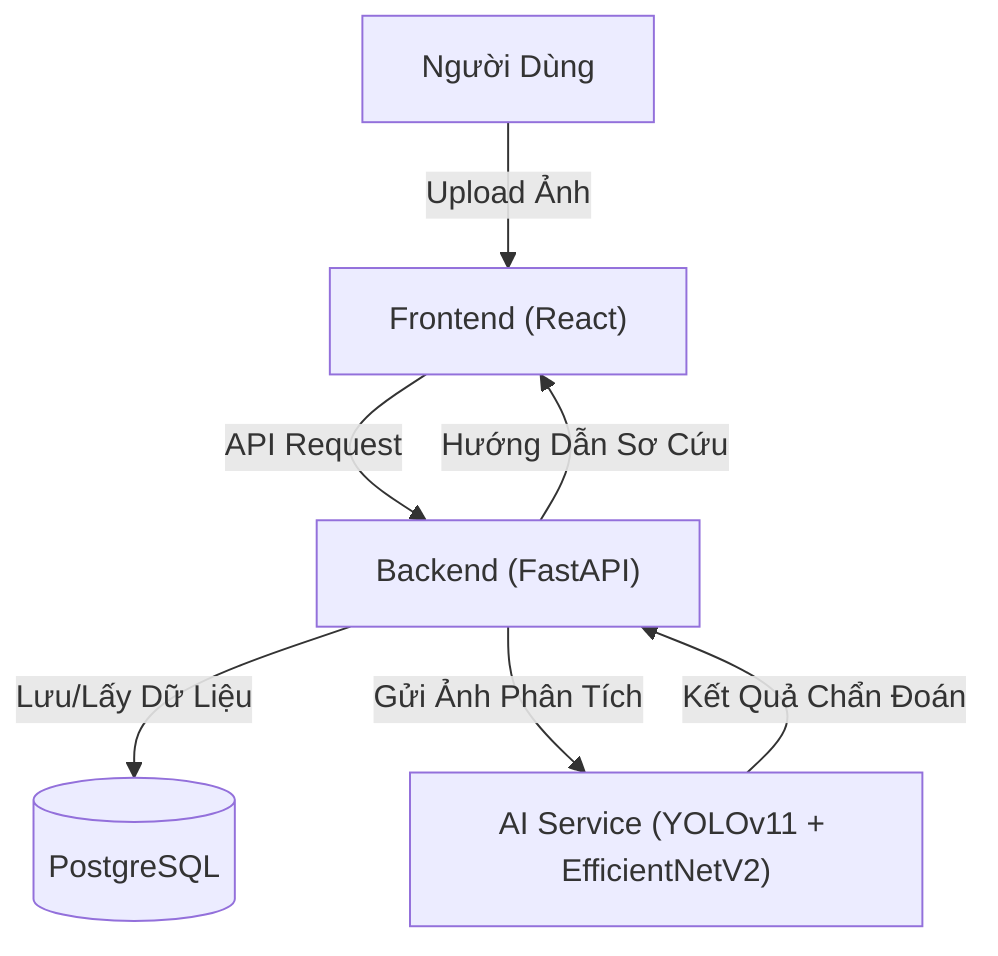

# C1SE.24 SkinAid Capstone 1 - Hệ Thống Hỗ Trợ Sơ Cứu Vết Thương

> **SkinAid** là hệ thống thông minh sử dụng trí tuệ nhân tạo để nhận diện vết thương qua hình ảnh, đánh giá mức độ nghiêm trọng và cung cấp hướng dẫn sơ cứu kịp thời.

---

## 🌟 Công Nghệ Nổi Bật

Dự án áp dụng các công nghệ tiên tiến nhất hiện nay:

| Thành phần       | Công nghệ                                                                                                                                  | Mô tả                                                                                                                       |
| :----------------- | :------------------------------------------------------------------------------------------------------------------------------------------- | :---------------------------------------------------------------------------------------------------------------------------- |
| **Backend**  |                                                                 | Xử lý logic, API hiệu năng cao, bất đồng bộ.                                                                          |
| **Frontend** |   | Giao diện hiện đại, trải nghiệm mượt mà với TypeScript.                                                             |
| **AI Core**  |            | **YOLOv11**: Phát hiện vị trí vết thương.`<br>`**EfficientNetV2**: Phân loại mức độ nghiêm trọng. |
| **Database** |                                                        | Lưu trữ dữ liệu an toàn, tin cậy.                                                                                       |
| **Deploy**   |                                                                    | Đóng gói và triển khai dễ dàng.                                                                                        |

---

## 📂 Cấu Trúc Hệ Thống



---

## 🚀 Hướng Dẫn Cài Đặt & Khởi Chạy

### 1. Sử dụng Docker (Khuyến Nghị)

Đây là cách nhanh nhất để chạy **Backend**, **Frontend** và **Database**.

**Yêu cầu:** Docker Desktop đã được cài đặt.

**Thực hiện:**

1. **Clone dự án:**

   ```bash
   git clone <repo-url>
   cd C1SE.24_SkinAid_Capstone1
   ```
2. **Thiết lập môi trường (.env):**
   Copy file mẫu `.env.example` thành `.env` cho từng thư mục (root, backend, ai_ml, frontend).

   ```bash
   cp .env.example .env                  # Root (cho docker-compose)
   cp backend/.env.example backend/.env  # Backend
   cp ai_ml/.env.example ai_ml/.env      # AI Service
   ```
3. **Khởi chạy:**

   ```bash
   docker-compose up -d --build
   ```

   *Lệnh này sẽ tự động tải images, build source code và start các containers.*
4. **Truy cập:**

   - Web App: [http://localhost:3000](http://localhost:3000)
   - API Doc: [http://localhost:8000/docs](http://localhost:8000/docs)
   - Database: Cổng 5433 (như cấu hình trong docker-compose)

---

### 2. Chạy Thủ Công (Cho Developers)

Nếu bạn cần debug hoặc phát triển từng module riêng lẻ.

#### 🔧 Thiết lập chung

Đảm bảo bạn đã cài đặt: **Python 3.10+**, **Node.js 18+**, **PostgreSQL**.

#### 🧠 A. Khởi chạy AI Service (Quan trọng)

*Module này cần chạy độc lập hoặc tích hợp nếu chưa có trong Docker Compose.*

1. Truy cập thư mục: `cd ai_ml`
2. Tạo venv và cài đặt thư viện:
   ```bash
   python -m venv venv
   # Windows:
   .\venv\Scripts\activate
   # Mac/Linux:
   source venv/bin/activate

   pip install -r requirements.txt
   ```
3. Chạy service:
   ```bash
   python run.py
   ```

   *Service sẽ chạy tại: http://localhost:8001*

#### 🔙 B. Khởi chạy Backend

1. Truy cập thư mục: `cd backend`
2. Cấu hình Database trong `.env` (trỏ về Postgres local của bạn).
3. Cài đặt và chạy:
   ```bash
   python -m venv venv
   .\venv\Scripts\activate
   pip install -r requirements.txt

   # Chạy migrations db
   alembic upgrade head

   # Start server
   uvicorn app.main:app --reload --port 8000
   ```

#### 🎨 C. Khởi chạy Frontend

1. Truy cập thư mục: `cd frontend`
2. Cài đặt và chạy:
   ```bash
   npm install
   npm run dev
   ```

   *App sẽ chạy tại: http://localhost:5173 (mặc định của Vite)*

---

## 📦 Chi Tiết Thư Mục Code

Để giúp bạn nắm bắt nhanh hệ thống mà không cần đọc README con:

* **`ai_ml/`**: Chứa logic xử lý ảnh.
  * `main.py` / `run.py`: Entrypoint của service.
  * `models/`: Nơi lưu file trọng số model (`.pt`, `.h5`, `.onnx`).
  * `pipeline/`: Các bước xử lý từ Preprocessing -> Detection (YOLOv11) -> Classification (EfficientNetV2).
* **`backend/`**: Trung tâm điều phối dữ liệu.
  * `app/api/`: Định nghĩa các endpoints.
  * `app/services/`: Logic nghiệp vụ (gọi AI, xử lý user, tính toán).
  * `app/models/`: Cấu trúc bảng Database (SQLAlchemy).
* **`frontend/`**: Giao diện người dùng.
  * `src/components/`: Các thành phần giao diện tái sử dụng.
  * `src/pages/`: Các màn hình chính (Trang chủ, Upload, Kết quả).

---

## 👥 Đóng Góp (Contribution)

Mọi đóng góp đều được hoan nghênh! Vui lòng tuân thủ quy trình:

1. Checkout nhánh `dev` hoặc tạo nhánh feature mới: `git checkout -b feature/Ten-Tinh-Nang`.
2. Commit có ý nghĩa (Semantic Commit).
3. Tạo Pull Request và tag người review.
