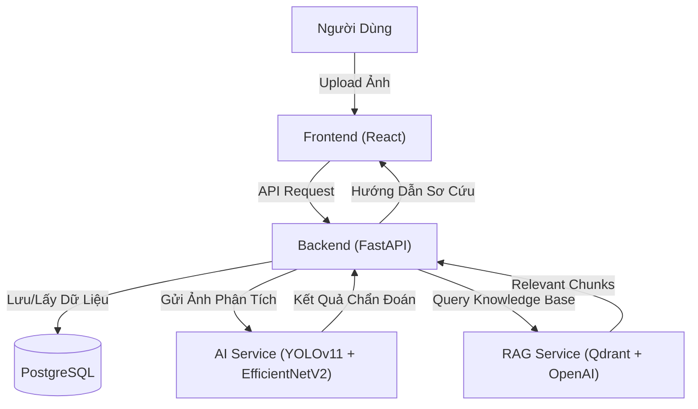

# C1SE.24 SkinAid Capstone 1 - Hệ Thống Hỗ Trợ Sơ Cứu Vết Thương

> **SkinAid** là hệ thống thông minh sử dụng trí tuệ nhân tạo để nhận diện vết thương qua hình ảnh, đánh giá mức độ nghiêm trọng, tra cứu kiến thức y tế qua RAG pipeline và cung cấp hướng dẫn sơ cứu kịp thời.

---

## 🌟 Công Nghệ Nổi Bật

| Thành phần | Công nghệ | Mô tả |
| :--- | :--- | :--- |
| **Backend** |  | Xử lý logic, API hiệu năng cao, bất đồng bộ. |
| **Frontend** |   | Giao diện hiện đại, trải nghiệm mượt mà với TypeScript. |
| **AI Core** |   | **YOLOv11**: Phát hiện vị trí vết thương. **EfficientNetV2**: Phân loại mức độ nghiêm trọng. |
| **RAG & LLM** |    | Hybrid Search (dense + sparse BM25), Contextual Retrieval để tra cứu hướng dẫn sơ cứu từ knowledge base y tế. |
| **Database** |  | Lưu trữ dữ liệu an toàn, tin cậy. |
| **Deploy** |  | Đóng gói và triển khai dễ dàng. |

---

## 📐 Cấu Trúc Hệ Thống



---

## 🤖 RAG Pipeline – Knowledge Retrieval

SkinAid tích hợp RAG pipeline để cung cấp hướng dẫn sơ cứu chính xác từ knowledge base y tế:

- **Hybrid Search**: Kết hợp dense vector (`text-embedding-3-large` của OpenAI) và sparse BM25 trên Qdrant, cho kết quả tìm kiếm chính xác hơn vector search đơn thuần.
- **Contextual Retrieval**: Dùng LLM (`gpt-4.1-mini`) sinh context mô tả ngữ cảnh cho từng chunk trước khi index, tăng độ chính xác retrieval theo kỹ thuật của Anthropic.
- **Semantic Chunking**: Tự động chia tài liệu theo ngữ nghĩa thay vì cắt cứng theo số ký tự, giữ nguyên tính liên kết của nội dung.
- **Multi-format Ingestion**: Hỗ trợ PDF, DOCX, HTML, CSV với OCR fallback (pytesseract) cho tài liệu dạng scan.
- **Background Indexing**: File upload được index bất đồng bộ qua FastAPI BackgroundTasks, không block request chính.

### Index Pipeline

```
Upload File → Validate → Load & Extract Text → Semantic Chunk
→ Contextual Retrieval (LLM) → Embed (OpenAI) → Upsert Qdrant
```

### Search Pipeline

```
Query → Hybrid Search (Dense + Sparse) → Re-rank by Score → Return Chunks → LLM Response
```

---

## 🔐 Backend Architecture

Backend được xây dựng theo layered architecture rõ ràng:

```
Router → Controller → Service → Repository → Database
```

Các tính năng nổi bật:

- **JWT Authentication** với Token Family management — phát hiện token reuse, tự động revoke toàn bộ family khi có dấu hiệu đánh cắp token.
- **Guest Session Management** — hỗ trợ dùng ẩn danh với cơ chế claim session khi đăng ký tài khoản.
- **RBAC** — phân quyền theo role với FastAPI dependency injection.
- **Audit Logging** — ghi log toàn bộ thao tác nhạy cảm với permission-based access control.
- **Structured Exception Handling** — global error handler, custom exception hierarchy cho từng module.

---

## 🚀 Hướng Dẫn Cài Đặt & Khởi Chạy

> ⚠️ **Lưu ý:** Code chính đang nằm ở branch `merge/log-admins_chatbot`. Hãy checkout branch đó để xem full source code.
>
> ```bash
> git checkout merge/log-admins_chatbot
> ```

### 1. Sử dụng Docker (Khuyến Nghị)

**Yêu cầu:** Docker Desktop đã được cài đặt.

1. **Clone dự án:**
   ```bash
   git clone https://github.com/NguyenTrungHieu3/skinaid-v2
   cd skinaid-v2
   git checkout merge/log-admins_chatbot
   ```

2. **Thiết lập môi trường (.env):**
   ```bash
   cp .env.example .env
   cp backend/.env.example backend/.env
   cp ai_ml/.env.example ai_ml/.env
   ```

   Các biến môi trường quan trọng cần cấu hình trong `backend/.env`:
   ```env
   OPEN_API_KEY=your_openai_api_key
   QDRANT=http://localhost:6333
   RAG_COLLECTION_NAME=skinaid_knowledge
   RAG_EMBEDDING_DIMENSION=3072
   RAG_SCORE_THRESHOLD=0.5
   RAG_DOCS_PATH=./docs
   ```

3. **Khởi chạy:**
   ```bash
   docker-compose up -d --build
   ```

4. **Truy cập:**
   - Web App: [http://localhost:3000](http://localhost:3000)
   - API Docs: [http://localhost:8000/docs](http://localhost:8000/docs)
   - Qdrant Dashboard: [http://localhost:6333/dashboard](http://localhost:6333/dashboard)

---

### 2. Chạy Thủ Công (Cho Developers)

**Yêu cầu:** Python 3.10+, Node.js 18+, PostgreSQL, Qdrant.

#### 🧠 A. Khởi chạy AI Service

```bash
cd ai_ml
python -m venv venv
.\venv\Scripts\activate       # Windows
source venv/bin/activate      # Mac/Linux
pip install -r requirements.txt
python run.py
# Service chạy tại: http://localhost:8001
```

#### 🔙 B. Khởi chạy Backend

```bash
cd backend
python -m venv venv
.\venv\Scripts\activate
pip install -r requirements.txt

alembic upgrade head          # Chạy migrations
uvicorn app.main:app --reload --port 8000
# API chạy tại: http://localhost:8000
```

#### 🎨 C. Khởi chạy Frontend

```bash
cd frontend
npm install
npm run dev
# App chạy tại: http://localhost:5173
```

---

## 📦 Chi Tiết Thư Mục Code

```
skinaid-v2/
├── backend/
│   └── app/
│       ├── modules/
│       │   ├── auth/          # JWT, Token Family, Guest Session
│       │   ├── audit/         # Audit Logging
│       │   ├── rag/           # RAG Pipeline (Loader, Chunking, Embedding, Qdrant)
│       │   ├── llm/           # LLM Service, Chatbot
│       │   ├── firstaid/      # First Aid guidance
│       │   └── ai/            # AI integration
│       ├── core/              # Config, Database, Dependencies
│       └── shared/            # Base exceptions, utilities
├── ai_ml/
│   ├── pipeline/              # Detection (YOLOv11) → Classification (EfficientNetV2)
│   └── models/                # Model weights
└── frontend/
    └── src/
        ├── components/        # Reusable UI components
        └── pages/             # Main screens
```

---

## 👥 Đóng Góp (Contribution)

1. Checkout nhánh `dev` hoặc tạo nhánh feature mới: `git checkout -b feature/Ten-Tinh-Nang`
2. Commit có ý nghĩa (Semantic Commit)
3. Tạo Pull Request và tag người review