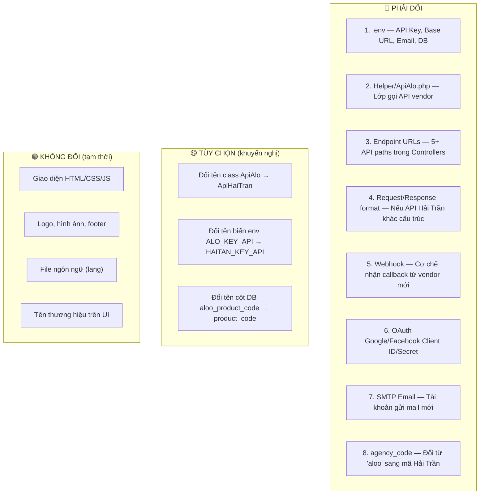

# 🎯 Giải Thích Nhiệm Vụ: Clone Project Aloo → Hải Trần

## 1. Vì Sao Sếp Giao Task Này?

### Bối cảnh kinh doanh

Project `aloo_esim_ec_web_laravel` hiện tại hoạt động theo mô hình **White-Label / Reseller (Đại lý)**:

```
┌──────────────────────────────────┐
│  Aloo (aloo.com.vn) — Vendor Mẹ │  ← Tổng kho eSIM, quản lý tồn kho, xử lý thanh toán VNPay
│  Cấp phát: API Key, Gói cước,   │
│  QR Code eSIM, Activation Code  │
└───────────┬──────────────────────┘
            │  API Key riêng cho mỗi đại lý
            ▼
┌──────────────────────────────────┐
│  Website Đại Lý (esim.aloo.com) │  ← Project Laravel này — "Cửa hàng bán lẻ"
│  Kho hàng: ❌ Không có           │
│  Chỉ là giao diện bán hàng      │
│  Gọi API ngược về Aloo          │
└──────────────────────────────────┘
```

**Bây giờ sếp muốn:** Tạo một bản sao của hệ thống này, nhưng **thay đổi "Vendor Mẹ"** — từ **Aloo** sang **Hải Trần**. Nghĩa là:

```
┌──────────────────────────────────┐
│  Hải Trần — Vendor Mẹ MỚI       │  ← Nhà cung cấp eSIM mới, có API riêng
│  Cung cấp: API Key mới,         │
│  Gói cước riêng, QR riêng       │
└───────────┬──────────────────────┘
            │  API Key mới
            ▼
┌──────────────────────────────────┐
│  Website Đại Lý (clone mới)     │  ← Cùng source code, nhưng "ruột" đổi sang Hải Trần
│  UI: Giữ nguyên (tạm thời)      │
│  Backend: Toàn bộ → Hải Trần    │
└──────────────────────────────────┘
```

### Mục đích cốt lõi

| # | Mục đích | Giải thích |
|---|----------|------------|
| 1 | **Mở rộng kinh doanh** | Công ty muốn bán eSIM từ nhiều nhà cung cấp khác nhau, không chỉ phụ thuộc vào Aloo |
| 2 | **Bán lại cho Hải Trần** | Hệ thống này sẽ được "bán" hoặc "cấp phép" cho Hải Trần sử dụng — họ cần một website riêng kết nối với hệ thống eSIM của chính họ |
| 3 | **Tái sử dụng code** | Thay vì viết lại từ đầu, clone project hiện tại và thay đổi "nguồn cấp" eSIM ở backend |
| 4 | **Tách biệt hoàn toàn** | Hai hệ thống (Aloo vs Hải Trần) phải chạy **độc lập**, không chia sẻ API Key, database, hay tài khoản dịch vụ |

---

## 2. Phạm Vi Công Việc (Scope)

> [!IMPORTANT]
> **UI/Frontend: GIỮ NGUYÊN** — Không đụng vào giao diện. Tất cả thay đổi chỉ ở phía **Backend**.

### Những gì CẦN thay đổi (Backend)



---

## 3. Bốn Lớp Cần Thay Đổi (Chi Tiết)

### 🔴 Lớp 1: Cấu hình môi trường (`.env`)

| Biến | Giá trị cũ (Aloo) | Cần đổi thành |
|------|-------------------|---------------|
| `APP_NAME` | `ESIM_ALOO` | `ESIM_HAITAN` (hoặc tên Hải Trần) |
| `ALO_KEY_API` | `1165ab97669b46f413c8cf0ad8e1fdee58aa7322` | API Key do Hải Trần cấp |
| `ALO_BASE_URL` | `https://staging.aloo.com.vn/` | Base URL API của Hải Trần |
| `MAIL_FROM_NAME` | `"CSKH ALOO"` | `"CSKH HẢI TRẦN"` |
| `MAIL_FROM_ADDRESS` | `quynh.hoang@rikai.technology` | Email mới của Hải Trần |
| `GOOGLE_CLIENT_ID/SECRET` | Của Aloo/Rikai | Tạo mới cho Hải Trần |
| `VITE_API_TOKEN` | Token Aloo | Token mới |
| `APP_URL` | `localhost` | Domain production mới |

### 🔴 Lớp 2: API Integration Layer

File trung tâm: [ApiAlo.php](file:///e:/aloo_esim_ec_web_laravel/Helper/ApiAlo.php)

**5 endpoint hiện tại gọi sang Aloo:**

| # | Endpoint | File gọi | Mục đích |
|---|----------|----------|----------|
| 1 | `POST /collaborator/api/v2/getGlobalPlans` | `ApiCommand.php`, `CacheGlobalPlans.php`, `CacheValidCountries.php`, `HomeController.php` | Import toàn bộ gói eSIM |
| 2 | `POST /collaborator/api/v2/verifyVnpay` | `CartController.php` | Xác minh thanh toán |
| 3 | `POST /collaborator/api/v2/verifyVNPAY` | `CartController.php` | Xác minh thanh toán (typo) |
| 4 | `POST /collaborator/api/v2/getOrders` | `CartController.php` | Lấy thông tin đơn hàng |
| 5 | `POST /collaborator/api/v2/getEsims` | `CartController.php` | Lấy QR/activation code |

**2 endpoint gọi từ frontend (Vue.js):**

| # | Endpoint | File | Mục đích |
|---|----------|------|----------|
| 6 | `POST /collaborator/api/v2/checkCoupon` | `Discount.vue` | Kiểm tra voucher |
| 7 | `POST /collaborator/api/v2/orderEsims` | `Payment.vue`, `Payone.vue` | Tạo đơn hàng & link VNPay |

**2 webhook (Aloo gọi ngược vào hệ thống):**

| # | Endpoint | File | Mục đích |
|---|----------|------|----------|
| W1 | `POST /api/success-payment` | `ApiController.php` | Nhận thông báo eSIM sẵn sàng |
| W2 | `GET /api/admin-update` | `ApiController.php` | Trigger đồng bộ lại giá |

### 🔴 Lớp 3: Database

- Cột `aloo_product_code` trong bảng `packages` — lưu mã sản phẩm từ vendor
- Cột `agency_code` trong bảng `packages` — hiện đang có giá trị `'aloo'`
- Cần tạo DB mới hoặc migrate dữ liệu

### 🔴 Lớp 4: Dịch vụ bên thứ 3

| Dịch vụ | Hiện tại | Cần làm |
|---------|----------|---------|
| Google OAuth | Dùng project Google của Aloo/Rikai | Tạo project Google mới cho Hải Trần |
| Facebook OAuth | Dùng app Facebook của Aloo | Tạo app Facebook mới cho Hải Trần |
| SMTP Email | Gmail Rikai | Gmail/email mới của Hải Trần |
| VNPay | Qua Aloo | Hỏi Hải Trần dùng VNPay riêng hay qua API? |

---

## 4. Rủi Ro & Cảnh Báo

> [!CAUTION]
> ### ⚠️ Rủi ro lớn nhất: API KHÔNG TƯƠNG THÍCH

Toàn bộ hệ thống hiện tại được thiết kế để gọi API cấu trúc **rất cụ thể** của Aloo:
- URL paths: `/collaborator/api/v2/...`
- Request format: `{ "param": { ... } }`
- Response format: `{ "result": { "data": { ... } } }`

**Nếu API của Hải Trần có cấu trúc khác** (khác URL path, khác format JSON, khác cách xác thực), bạn sẽ phải:
1. Viết lại logic trong `ApiAlo.php`
2. Sửa tất cả Controllers parse response
3. Có thể phải sửa cả Vue.js components (Payment.vue, Payone.vue, Discount.vue)

> [!WARNING]
> ### ⚠️ `agency_code` hardcoded trong 2 file Vue.js

Trong [Payment.vue](file:///e:/aloo_esim_ec_web_laravel/Modules/Ecommerce/resources/assets/js/Payment.vue) (line 475) và [Payone.vue](file:///e:/aloo_esim_ec_web_laravel/Modules/Ecommerce/resources/assets/js/Payone.vue) (line 404):
```js
agency_code: 'aloo',  // ← Hardcoded, phải đổi
```
Đây tuy là file frontend nhưng ảnh hưởng trực tiếp đến logic backend (gửi lên API), nên **PHẢI đổi**.

> [!WARNING]
> ### ⚠️ File `.env` hiện tại có 2 block `APP_NAME` / `APP_KEY` trùng lặp
> Lines 2-8 và lines 11-15 đều khai báo `APP_NAME`, `APP_ENV`, `APP_KEY`. Cần dọn dẹp để tránh nhầm lẫn.

---

## 5. Những Gì Cần Nắm Rõ Trước Khi Bắt Tay Làm

| # | Cần nắm | Tại sao quan trọng |
|---|---------|---------------------|
| 1 | **Kiến trúc Reseller** | Hệ thống này KHÔNG tự phát hành eSIM, chỉ là "cửa hàng" gọi API vendor. Đổi vendor = đổi "nhà kho" |
| 2 | **`Helper/ApiAlo.php` là trái tim** | Mọi kết nối với vendor đều đi qua file duy nhất này |
| 3 | **5 endpoint + 2 webhook** | Đây là 7 "đường dây" nối tới Aloo cần cắt và nối lại sang Hải Trần |
| 4 | **Vue.js cũng gọi API vendor** | `Payment.vue`, `Payone.vue`, `Discount.vue` gọi trực tiếp API vendor (qua proxy) |
| 5 | **Cache file JSON** | Dữ liệu eSIM được cache tại `public/cache/global_plans.json` — sau khi đổi API phải regenerate |
| 6 | **Có tài liệu sẵn** | File [huong_dan_chuyen_doi_api_vendor.md](file:///e:/aloo_esim_ec_web_laravel/huong_dan_chuyen_doi_api_vendor.md) đã soạn sẵn rất chi tiết (554 dòng), có checklist từng file từng dòng |

---

## 6. Lộ Trình Đề Xuất

```
Phase 1: Thu thập thông tin từ Hải Trần
   ↓
Phase 2: Clone repo, setup môi trường riêng
   ↓
Phase 3: Đổi .env (API key, base URL, email, OAuth)
   ↓
Phase 4: Kiểm tra tương thích API (quan trọng nhất!)
   ↓
Phase 5: Sửa code backend (endpoints, request/response format)
   ↓
Phase 6: Đổi agency_code trong Vue.js
   ↓
Phase 7: Setup DB mới, chạy migrate + đồng bộ packages
   ↓
Phase 8: Test end-to-end (mua eSIM → thanh toán → nhận QR)
   ↓
Phase 9: Deploy lên server mới
```

---

## 7. ❓ CÂU HỎI CẦN XÁC NHẬN VỚI BẠN

Trước khi tôi bắt tay vào làm bất cứ điều gì, tôi cần bạn trả lời/xác nhận các câu hỏi sau:

### Câu hỏi về scope

1. **Bạn đã có thông tin API của Hải Trần chưa?** (Base URL, API Key, tài liệu API endpoints, format request/response)
2. **API của Hải Trần có cùng cấu trúc với Aloo không?** (Cùng endpoint paths `/collaborator/api/v2/...`? Cùng format JSON?). Nếu chưa biết, có thể cung cấp tài liệu API của Hải Trần để tôi so sánh?
3. **Bước "clone project" — bạn muốn thực hiện thế nào?**
   - a) Tạo branch mới trên cùng repo?
   - b) Copy ra một repo/folder riêng biệt hoàn toàn?
   - c) Hay chỉ sửa trực tiếp trên project hiện tại?

### Câu hỏi về backend

4. **Có cần đổi tên biến `.env` không?** (VD: `ALO_KEY_API` → `HAITAN_KEY_API`), hay chỉ đổi **giá trị** (giữ nguyên tên biến cho nhanh)?
5. **Có cần đổi tên class `ApiAlo` → `ApiHaiTran` không?** Hay giữ nguyên tên class, chỉ đổi nội dung bên trong?
6. **Hải Trần dùng VNPay riêng hay thông qua API của họ** (giống Aloo hiện tại)?

### Câu hỏi về database

7. **Database:** Deploy server mới với DB trống, hay dùng chung server hiện tại?
8. **Cột `aloo_product_code`** trong bảng `packages`: có cần rename không? (Chức năng không ảnh hưởng, chỉ là vấn đề clean code)

### Câu hỏi về timeline & ưu tiên

9. **Ưu tiên làm gì trước?** Backend API integration trước (để test chức năng), hay dọn dẹp branding trước?
10. **Khi nào cần bàn giao?** Deadline cụ thể để tôi ước lượng khối lượng công việc cần làm trong mỗi phase?

> [!IMPORTANT]
> Tôi sẽ **KHÔNG** thực hiện bất kỳ thay đổi code nào cho đến khi bạn trả lời các câu hỏi trên và cho phép tôi bắt đầu.
